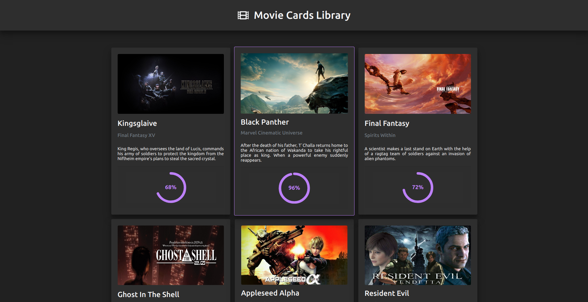

# Movie Cards Library

 
 

### This was the first project from Trybe's Front-end module.

### The goal was to create a Movie Cards Library with React, using concepts that included Props, Components, JSX and PropTypes.
 

## - Requirements:

* 1 - Create a `<Header />` component;
* 2 - Render a text in the `<Header />` component;
* 3 - Create a `<MovieList />` component;
* 4 - Render `<MovieCard />` components within `<MovieList />`;
* 5 - Pass a key to each `<MovieCard />` rendered;
* 6 - Create a `<MovieCard />` component;
* 7 - Render the movie’s image inside an `img` tag;
* 8 - Render the movie’s title inside an `h4` tag;
* 9 - Render the subtitle of the movie inside an `h5` tag;
* 10 - Render the synopsis of the movie inside a `p` tag;
* 11 - Create a `<Rating />` component;
* 12 - Render the rating of a movie within `Rating`;
* 13 - Render the component within `<MovieCard />`;
* 14 - Pass as prop to the `<Rating/>` component, the rating attribute;
* 15 - Create an `<App />` component;
* 16 - Render `<MovieList />` inside the component;
* 17 - Add `PropTypes` to all components.